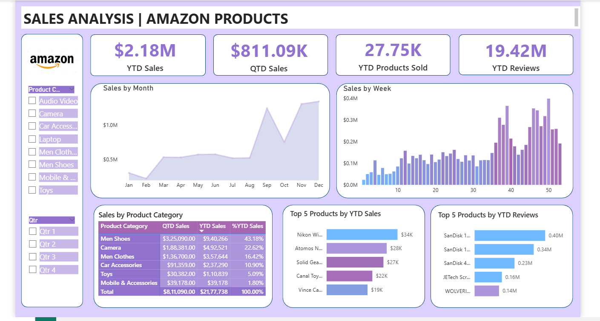

# **Amazon Product Sales Analysis Dashboard**

## **Project Overview**
This project presents an **interactive Power BI dashboard** that analyzes Amazon product sales performance. The goal of this analysis is to understand **sales trends, product performance, and customer engagement** using visual data insights.

The dashboard helps identify **top-performing products, category-wise sales contribution, and seasonal sales patterns**, enabling better business decision-making.

---

## Dashboard Preview

---

## **Key Metrics**
The dashboard tracks important business metrics including:

- **$2.18M** – Year-to-Date (YTD) Sales  
- **$811.09K** – Quarter-to-Date (QTD) Sales  
- **27.75K** – Products Sold (YTD)  
- **19.42M** – Customer Reviews (YTD)

These metrics provide a quick overview of overall sales performance and customer engagement.

---

## **Dashboard Features**

### **Sales Trend Analysis**
- Monthly sales trends to identify seasonal demand
- Weekly sales performance to observe short-term fluctuations

### **Product Category Analysis**
- Sales contribution by product category
- Comparison of QTD and YTD sales across categories

### **Top Product Insights**
- Top 5 products based on **YTD sales**
- Top 5 products based on **customer reviews**

### **Interactive Filters**
Users can explore the data using filters such as:
- **Product Category**
- **Quarter (Q1–Q4)**

These filters allow deeper analysis of sales patterns.

---

## **Insights Gained**

Key insights from the dashboard include:

- **Men Shoes and Camera categories generate the highest sales revenue**
- Sales significantly **increase towards the end of the year**, indicating seasonal demand
- Products with **higher customer reviews often show stronger sales performance**
- Weekly sales patterns highlight **periods of higher customer activity**

---

## **Tools & Technologies Used**

- **Power BI** – Data visualization and dashboard development
- **Excel / Dataset** – Data source
- **Data Modeling** – Creating relationships and calculated measures

---

## **Business Value**

This dashboard helps businesses:

- Monitor **overall sales performance**
- Identify **top-performing products and categories**
- Understand **customer engagement through reviews**
- Detect **sales trends and seasonal patterns**

---

## **Conclusion**

The **Amazon Product Sales Analysis Dashboard** provides a clear and interactive view of sales performance and product insights. It enables stakeholders to make **data-driven decisions** by understanding trends, customer behavior, and product demand.

---

⭐ *If you found this project useful, feel free to star the repository.*
